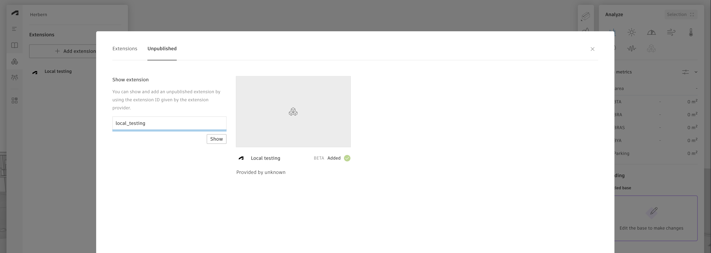
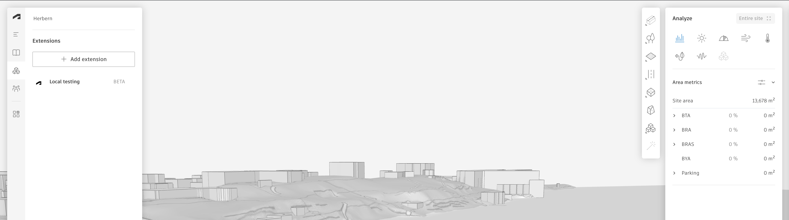

# Embedded view example: Local file explorer

## Description

This example illustrates how to create your own custom UI inside Forma. It will appear as a file browser for Forma left side and allow browsing files under a specific locally hosted folder. 
 
The goal of this example is to have an easy-to-use example that anyone can start to build upon. 
You can see this as an example to view alongside [the official documentation found on autodesk platform services](https://aps.autodesk.com/en/docs/forma/v1).

## Thumbnail

# Setup

## Prerequisites:

- Some understanding of what [Forma](https://www.autodesk.ca/en/products/forma/overview?term=1-YEAR&tab=subscription) is.
- Some prior knowledge of web technologies, html, javascript and css.
- Make sure you have `node` installed on your machine. You can get it at https://nodejs.org/.

## How to run it

1. Clone this repository
2. Download some models, like this collection from Kenney.nl (consider donating): [city-kit-suburban](https://kenney.nl/assets/city-kit-suburban). Place the unzipped folder inside `src/public/`.
>If the folder contains GLB 3D model files, then this application can put those files into the Forma Library.
3. Install the http-server package, by running `npm install -g http-server`
2. Host the files statically using by running `npx http-server ./src -c-1` from inside root of this repository
4. Inside the Forma web application, go to extensions, and add the unpublished extension: `local_testing`.
   
   

5. Click `Local testing` in the left extension menu to see your app.

   

## Project Contents

There are 4 files:

- `src/index.html`: This file is the entrypoint for your app. It contains imports and some css styles.
- `src/main.js`: The main file. This file contains the code for rendering the ui based on user interactions.
- `src/filebrowser.js`: This file crawls Google Chrome's default local file viewer and stuctures the results.
- `src/sdk.js`: Here, all interactions with the host Forma application is done. Here, an element is created from a GLB file.

## Further reading
Head over to the official Forma documentation for more Functionality, APIs and how tos. 

For questions regarding this repository, please feel free to ask them on the GitHub issues feature.

https://aps.autodesk.com/en/docs/forma/v1

## License

This sample is licensed under the terms of the [MIT License](http://opensource.org/licenses/MIT). Please see the [LICENSE](LICENSE) file for full details.

## Written by

This repository was created and is maintained by the Interoperability squad, Unified Design, Autodesk inc.  

